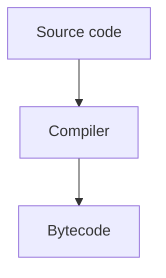

<div align="center">

# JavaBook

### A personal, practical way to learn Java better

Build Java knowledge one chapter at a time with focused notes, runnable examples,
visual explanations, interview practice, and a calm book-style learning experience.

<p>
  
  
  
  
</p>

<p>
  
  
  
</p>

</div>

> **Personal learning project:** JavaBook was created for my own Java learning journey.
> The goal is to understand Java more clearly and deeply by turning each topic into
> structured notes, examples, diagrams, and practice questions that I can revisit
> whenever I need a stronger foundation.

## Contents

- [About the project](#about-the-project)
- [Learning goals](#learning-goals)
- [What is included](#what-is-included)
- [Course coverage](#course-coverage)
- [Technology stack](#technology-stack)
- [Project structure](#project-structure)
- [Getting started](#getting-started)
- [Writing a chapter](#writing-a-chapter)
- [Markdown features](#markdown-features)
- [Useful commands](#useful-commands)
- [Design principles](#design-principles)
- [Roadmap](#roadmap)
- [Personal note](#personal-note)

## About the project

JavaBook is a personal Java documentation and study website. It combines the
organization of a course, the readability of a book, and the convenience of
searchable developer documentation.

Instead of keeping disconnected notes, every concept lives in a consistent chapter
format. Each chapter can contain:

- Explanations in plain language
- Java code examples
- Comparisons and reference tables
- ASCII diagrams and visual flows
- Automatically rendered Mermaid diagrams
- Chapter navigation and a table of contents
- Interview questions and practice prompts

The project is intentionally designed for learning, revision, and continuous
improvement rather than as a production Java framework or a public course platform.

## Learning goals

JavaBook is built to help me:

1. Learn Java from the fundamentals instead of memorizing isolated syntax.
2. Understand how Java behaves, not only how to write code that compiles.
3. Connect object-oriented concepts with real examples.
4. Review difficult topics quickly through searchable notes.
5. Use diagrams to understand memory, execution, collections, and concurrency.
6. Practise explaining concepts as preparation for interviews.
7. Build a long-term reference that improves as my understanding improves.

## What is included

| Feature | Description |
| --- | --- |
| **51 chapters** | A structured path from Java basics to JVM concepts and interview preparation. |
| **Markdown content** | Chapters are easy to write, edit, version, and review. |
| **Chapter navigation** | Previous/next links, grouped sidebar navigation, and homepage cards. |
| **Search** | Search chapter titles, descriptions, headings, and body text. |
| **Table of contents** | Automatically generated from chapter headings. |
| **Syntax highlighting** | Colorful highlighting is limited to code blocks for readability. |
| **Code copying** | Copy buttons make examples easy to reuse while studying. |
| **Diagram support** | ASCII learning diagrams can be converted to Mermaid automatically. |
| **Responsive layout** | The reading experience works on desktop and smaller screens. |
| **Interview practice** | Chapter 51 and homepage prompts support revision and practice. |
| **Monochrome UI** | The interface uses a focused black, white, and grey visual system. |

## Course coverage

The current roadmap is organized into these learning areas:

| Area | Topics |
| --- | --- |
| **Java Foundations** | Introduction, setup, variables, operators, input/output, conditions, loops, methods, arrays, and strings |
| **Object-Oriented Programming** | Classes, objects, constructors, `this`, `static`, encapsulation, inheritance, polymorphism, abstraction, interfaces, and design |
| **Core Java APIs** | Packages, access modifiers, exceptions, files, wrappers, generics, enums, and date/time |
| **Collections Framework** | Lists, sets, maps, queues, deques, iterators, heaps, and sorting |
| **Functional Java** | Lambda expressions, functional interfaces, streams, and `Optional` |
| **Concurrency & the JVM** | Threads, synchronization, executors, futures, JVM memory, garbage collection, and performance |
| **Projects & Practice** | Modern Java, project-oriented revision, the complete roadmap, and interview preparation |

## Technology stack

- **Next.js** — application framework, routing, static generation, and metadata
- **React** — interactive UI components
- **TypeScript** — typed application code
- **Unified** — Markdown processing pipeline
- **Remark / Rehype** — Markdown parsing and HTML transformation
- **Highlight.js** — code syntax highlighting
- **Mermaid** — rendered diagrams
- **Node.js** — local development and scripts

## Project structure

```text
javabook/
├── data/                         # Markdown chapters
│   ├── 01-java-introduction.md
│   ├── ...
│   └── 51-java-interview-and-practice.md
├── public/                       # Favicon and static assets
├── scripts/
│   └── test-ascii.mjs            # ASCII diagram conversion check
├── src/
│   ├── app/
│   │   ├── learn/[slug]/         # Dynamic chapter route
│   │   ├── page.tsx              # Homepage
│   │   ├── layout.tsx            # Root layout and metadata
│   │   └── globals.css           # Global visual system
│   ├── components/               # Search, navigation, TOC, and enhancements
│   └── lib/
│       ├── chapters.ts           # Chapter discovery and metadata
│       ├── curriculum.ts         # Roadmap and chapter grouping
│       ├── markdown.ts           # Markdown rendering pipeline
│       └── search.ts             # Search index generation
├── next.config.mjs
├── package.json
└── README.md
```

## Getting started

### Requirements

- Node.js 18.18 or newer
- npm

### Install dependencies

```bash
npm install
```

### Start the development server

```bash
npm run dev
```

Open <http://localhost:3000> in a browser.

### Create a production build

```bash
npm run build
npm start
```

The production server runs at <http://localhost:3000> by default.

## Writing a chapter

Create a Markdown file inside `data/` using this format:

```text
NN-short-title.md
```

For example:

```text
52-java-generics-deep-dive.md
```

The number determines the chapter's position in the roadmap. Add the matching
chapter entry to `src/lib/curriculum.ts` when the chapter should appear in a
specific curriculum group.

Start the file with a heading:

```markdown
# Chapter 52 — Java Generics Deep Dive

> Java Master Course · Chapter 52
>
> Learn how bounded type parameters and wildcards improve type-safe APIs.

## Learning objectives

By the end of this chapter, you will understand ...
```

The first level-one heading becomes the chapter title. Opening blockquotes are used
to create the chapter description shown on cards and in search results.

## Markdown features

### Java code blocks

Use a `java` code fence for syntax highlighting and a copy button:

````markdown
```java
public class HelloJava {
    public static void main(String[] args) {
        System.out.println("Hello, JavaBook!");
    }
}
```
````

### Output and ASCII diagrams

Use `text` or `txt` blocks for output and diagrams. Flow, tree, and pointer
diagrams can be converted to Mermaid automatically:

````markdown
```text
main()
  ↓
create object
  ↓
call method
```
````

The original ASCII version remains available through the diagram toggle.

### Manual Mermaid diagrams

For diagrams that need custom syntax, use a Mermaid fence:

````markdown

````

### Checklists

Three or more lines beginning with `✓` are rendered as a checklist:

````markdown
```text
✓ Read the explanation
✓ Run the example
✓ Explain the result in your own words
```
````

## Useful commands

| Command | Purpose |
| --- | --- |
| `npm run dev` | Start the local development server |
| `npm run build` | Create and validate the production build |
| `npm start` | Start the production server |
| `npm run test:ascii` | Check ASCII diagram conversion coverage |
| `npm run test:ascii -- --verbose` | Show detailed diagram conversion results |

## Design principles

JavaBook follows a few simple principles:

- **Understand before memorizing.** Explanations should answer why, not only what.
- **Prefer small examples.** A short runnable example is easier to revisit.
- **Connect concepts.** New topics should link back to earlier Java foundations.
- **Make difficult ideas visible.** Use diagrams for memory, execution, and flow.
- **Keep the interface calm.** The reading surface should not compete with the content.
- **Practise retrieval.** Interview questions help turn passive reading into active recall.
- **Improve continuously.** Chapters can be corrected and expanded as understanding grows.

## Roadmap

Planned improvements for this personal workspace include:

- Add more runnable Java exercises to important chapters.
- Add small quizzes and self-check prompts.
- Expand project-based learning after the core chapters.
- Add more JVM and concurrency visualizations.
- Improve chapter cross-links and related-topic recommendations.
- Keep refining explanations based on real study sessions.

## Personal note

This project is made for my personal use so I can learn Java in a more organized,
visual, and practical way. It is a study companion: a place to write what I learn,
test whether I really understand it, and return to difficult topics without starting
from scattered notes every time.

The most important goal is not simply to finish all 51 chapters. It is to understand
the ideas well enough to explain them, use them in code, and recognize when each
tool or design choice is appropriate.

---

<div align="center">

**JavaBook · Learn Java clearly. Practise deliberately. Build understanding.**

<sub>Made by Akshit Suthar for personal learning and continuous improvement.</sub>

</div>
